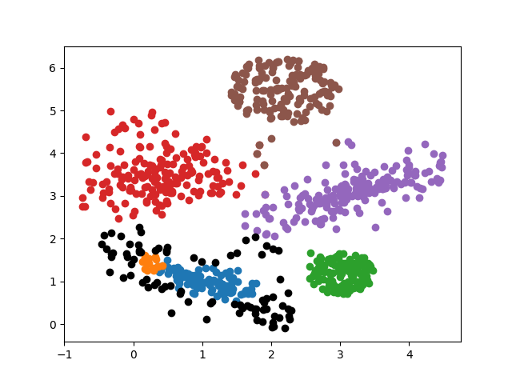
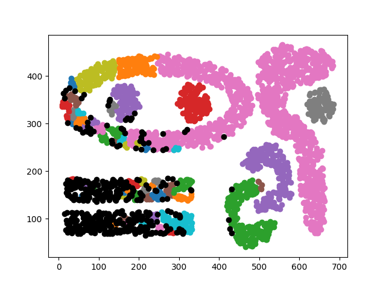
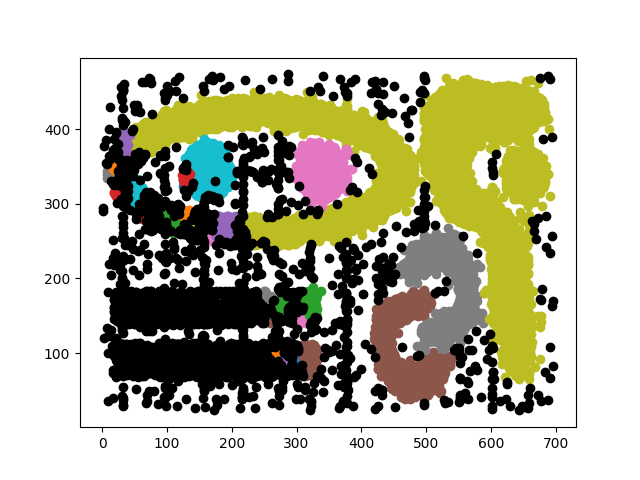

#DBSCAN+
DBSCAN+ is a simple script for clustering using DBSCAN algorithm. All of three implementations are "+" versions witch is
slight modification of original DBSCAN algorithm - it means that each of non-core points can be classified to more than 
one cluster. All implemented versions use Tanimoto similarity measure as a distance measure. All of them are also
optimized - candidates for potential neighbours are preselected using case-dependent distance bounds.

The implemented versions include:
* ClassicDBSCAN - DBSCAN+ implementation for all kinds of data
* RVVDBSCAN - DBASCAN+ implementation for real valued vectors
* ZPNDBSCAN - DBSCAN+ implementation for ZPN vectors

##Usage
Scripts uses four optional arguments as follows:
* --dataset_path - path to the dataset
* --version - version of DBSCAN+ algorithm (possible choices: ClassicDBSCAN, RVVDBSCAN, PNDBSCAN)
* --eps - value of epsilon
* --min_points - minimal number of neighbour points for a point to be considered as a core point

Example usage

```bash
python dbscan.py --dataset_path test_dataset.py --version ClassicDBSCAN --eps 0.1 --min_points 11
```

Input data is a csv file with vectors coordinates as a columns. Real cluster class must be in the last column. Data
starts from the first row.

Execution produces two files. out* contains all dataset points and clusters to which they are assigned. stats* file
contains all experiment data including execution time, number of discovered clusters, clustering qulity measures etc.

##Implementation
Most of implementation is contained in base abstract class called DBSCAN. Implemented versions differ only in 
neighbourhood_interval function (functon that calculates interval used for selecting potential neighbours for a point),
so only this function is implemented in each of child classes.

##Example results
Below results of DBSCAN clustering algorithm are presented. All results are obtained using ClassicDBSCAN class. All
datasets and clustering results are contained in datasets and results folders respectively. Datasets sources:
[clustering benchmark](https://github.com/deric/clustering-benchmark/tree/master/src/main/resources/datasets/artificial),
[real world clustering benchmark](https://github.com/deric/clustering-benchmark/tree/master/src/main/resources/datasets/real-world)

###Test data
Epsilon: 0.98, MinPoints: 15, Discovered clusters: 6, RAND score: 0.963


###Artificial complex9
Epsilon: 0.9995, MinPoints: 4, Discovered clusters: 58, RAND score: 0.908


###Artificial cluto_t7_10k
Epsilon: , MinPoints: , Discovered clusters: , RAND score: 


###Letter
Epsilon: , MinPoints: , Discovered clusters: , RAND score: 


##Conlcusions
Presented clustering algorithms achieve high RAND scores, However, because of using Tanimoto similarity measure instead
of euclidean distance the results are quite different than the results obtained using basic DBSCAN. Two points, that
have the same euclidean distance can have very different Tanimoto similarity measure dependent on theirs location. The
closer these two points are to the point (0, 0) the more different the Tanimoto measure between them will be. You can
easily observe this phenomenon on the attached results.

#References
[1] Data Mining lectures by Marzena Kryszkiewicz, Warsaw University of Technology, 2021

[2] [A Density-Based Algorithm for Discovering Clusters by Martin Ester, Hans-Peter Kriegel, Jorg Sander, Xiaowei Xu, 1996](https://www.aaai.org/Papers/KDD/1996/KDD96-037.pdf)

[3] [Clustering datasets by Tomas Barton](https://github.com/deric/clustering-benchmark/tree/master/src/main/resources/datasets)
